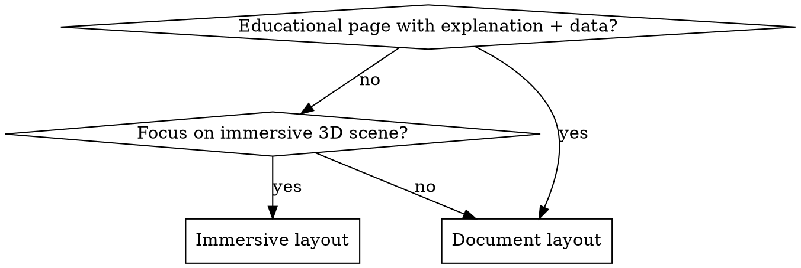

# Creating Physics 3D Simulations

## Overview

Build **single-file HTML** physics simulations that run in the browser with no build step. Prioritize **3D visualization** (Three.js r128) and **rich interactivity** — students learn by manipulating parameters and seeing instant visual feedback.

**Core principle:** Every simulation must be explorable without reading instructions first. Sliders, drag, camera control, and live readouts are not optional extras.

## When to Use

- Creating a new `.html` physics demo for this repo
- Adding 3D to an existing 2D canvas simulation
- Porting a textbook diagram into an interactive WebGL scene
- Any agent or app generating pages that must match this project's design system

**When NOT to use:** Landing pages (`index.html`), admin tools, or pages without physics visualization.

## Mandatory Architecture

| Rule | Requirement |
|------|-------------|
| **Single file** | All HTML, CSS (Tailwind classes), and JS in one `.html` file |
| **No bundler** | CDN only — never add Webpack, Vite, or npm for individual sims |
| **Three.js version** | `r128` via cdnjs — do not use OrbitControls |
| **Styling** | Tailwind CSS v3 CDN + Inter font |
| **Mobile first** | Touch targets ≥ 44px; layout stacks on mobile |
| **i18n** | English (`en`) + Traditional Chinese Hong Kong (`zh-hk`) minimum |

## Interactivity Requirements (Non-Negotiable)

Every 3D simulation **must** include:

1. **Parameter sliders** — HTML `<input type="range">` with live value display (`oninput`, not just `onchange`)
2. **Camera control** — drag to rotate, scroll/pinch to zoom (see reference patterns)
3. **Touch support** — single-finger rotate + two-finger pinch zoom on the canvas container
4. **Reset button** — restores default state and camera
5. **Live data panel** — numeric readouts that update as parameters change
6. **Canvas legend** — glass overlay pills showing semantic colours (F, v, B, etc.)
7. **Window resize handler** — update camera aspect + renderer size

**Strongly recommended** (include at least 2):

- **3D object drag** via `THREE.Raycaster` + intersection plane (see `Convex_Lens_3D.html`)
- **Preset buttons** for common teaching scenarios
- **Animated vectors** — flowing arrows, lerped motion (`lerp factor ~0.08`)
- **Explain modal** — physics interpretation with semantic colour legend
- **Practice questions** — `initPracticeQuestions('sim_id')` footer widget

**Forbidden shortcuts:**

- Static scene with no user controls
- Camera hints without actual touch handlers
- Physics updated only on button click (must respond to slider drag)
- Missing resize handler

## Layout Decision



| Layout | Structure | Examples |
|--------|-----------|----------|
| **Document** | Sticky nav → `max-w-7xl` → `grid lg:grid-cols-12` (controls \| canvas) | `Motor_Effect_3D.html`, `Convex_Lens_3D.html` |
| **Immersive** | `overflow-hidden` body → fullscreen canvas + floating glass panel | `Lorentz_Force_3D.html`, `Current_Balance_3D.html` |

## Physics Semantic Colours (CRITICAL)

Use these colours in **both** UI (Tailwind) and 3D (hex):

| Quantity | Hex | Tailwind | Usage |
|----------|-----|----------|-------|
| Force (F) | `#DC2626` | `text-red-600` | ArrowHelper, force labels |
| Velocity / Current (v, I) | `#16A34A` | `text-green-600` | Motion arrows, current flow |
| Acceleration (a) | `#9333EA` | `text-purple-600` | Acceleration vectors |
| Magnetic Field (B) | `#D97706` | `text-amber-600` | Field lines, B arrows |
| Displacement | `#475569` | `text-slate-600` | Position markers |

Define once in JS:

```javascript
const PHYSICS_COLORS = {
  force: 0xdc2626, velocity: 0x16a34a, accel: 0x9333ea,
  bField: 0xd97706, displacement: 0x475569
};
```

## i18n Pattern (en + zh-hk)

```javascript
const translations = {
  en: { 'page.title': 'Simulation Title', /* ... */ },
  'zh-hk': { 'page.title': '模擬標題', /* ... */ }
};
let currentLang = localStorage.getItem('preferred_language') || 'en';

function t(key) {
  return translations[currentLang]?.[key] ?? key;
}

function setLanguage(lang) {
  currentLang = lang;
  localStorage.setItem('preferred_language', lang);
  document.documentElement.lang = lang === 'zh-hk' ? 'zh-HK' : 'en';
  document.querySelectorAll('[data-i18n]').forEach(el => {
    const key = el.getAttribute('data-i18n');
    const val = translations[lang]?.[key];
    if (!val) return;
    if (key.includes('desc') || key.includes('legend') || key.includes('interpret')) {
      el.innerHTML = val;
    } else {
      el.textContent = val;
    }
  });
  document.querySelectorAll('.lang-btn').forEach(btn => {
    const active = btn.dataset.lang === lang;
    btn.classList.toggle('bg-blue-600', active);
    btn.classList.toggle('text-white', active);
  });
  if (window.MathJax?.typesetPromise) MathJax.typesetPromise();
}
```

**HTML:** `data-i18n="area.element"` on all visible text. Key naming: `page.title`, `controls.reset`, `legend.force`, `modal.explain`.

**Language buttons:** EN + 繁 (zh-hk). Store key: `preferred_language`.

## Three.js Setup Checklist

1. `PerspectiveCamera(45, aspect, 0.1, 1000)` — aspect from container, not window (document layout)
2. `WebGLRenderer({ antialias: true })` + shadow maps
3. `AmbientLight(0xffffff, 0.6)` + `DirectionalLight` with shadows
4. Custom spherical camera (no OrbitControls) — copy from reference patterns
5. `requestAnimationFrame` loop; physics in `updateSimulation()` on input, motion lerp in `animate()`
6. `renderer.setPixelRatio(Math.min(devicePixelRatio, 2))` on mobile-capable sims

## UI Components (Design System)

Follow `DESIGN_SYSTEM.md`:

- **Primary button:** `px-5 py-2.5 rounded-xl bg-blue-600 text-white font-semibold hover:bg-blue-700 hover:-translate-y-0.5`
- **Glass panel:** `bg-white/80 backdrop-blur-md border border-white/20 rounded-3xl shadow-xl`
- **Slider:** `accent-blue-600` (or semantic colour matching quantity)
- **Canvas container:** `relative rounded-xl border-2 border-slate-200 overflow-hidden`
- **Hint pill:** `absolute bottom-6 right-6 bg-gray-900/80 backdrop-blur text-white px-5 py-3 rounded-full text-sm pointer-events-none`

## Head CDN Block (Copy Order)

```html
<meta charset="UTF-8">
<meta name="viewport" content="width=device-width, initial-scale=1.0">
<script src="https://cdn.tailwindcss.com"></script>
<link href="https://fonts.googleapis.com/css2?family=Inter:wght@400;500;600;700&display=swap" rel="stylesheet">
<script src="https://cdnjs.cloudflare.com/ajax/libs/three.js/r128/three.min.js"></script>
<!-- Optional: MathJax for LaTeX -->
<script src="https://cdn.jsdelivr.net/npm/mathjax@3/es5/tex-svg.js"></script>
<style>mjx-container { display: inline-block !important; }</style>
```

## Workflow

1. **Pick template** — start from closest existing sim (`Motor_Effect_3D.html` for EM, `Convex_Lens_3D.html` for raycaster drag, `Primary_Colour_3D.html` for touch)
2. **Implement physics** — comment formulas; separate `state` object from rendering
3. **Wire interactivity** — sliders → `updateSimulation()` → sync 3D + readouts
4. **Add camera + touch** — copy spherical camera + touch block from reference
5. **Add i18n** — all strings in `translations`; test both languages
6. **Register in `index.html`** — add card under correct topic section
7. **Add practice questions** — entry in `practice_questions_data.js` + `initPracticeQuestions()`
8. **Manual test** — mobile, tablet, desktop; verify semantic colours

## Common Mistakes

| Mistake | Fix |
|---------|-----|
| Camera hint without touch handlers | Copy touch block from `Primary_Colour_3D.html` |
| No resize handler | Add `window.addEventListener('resize', ...)` updating aspect + renderer |
| Hardcoded English strings | Wrap in `data-i18n` + `translations` |
| Force colour as blue | Force is always red (`#DC2626`) |
| Physics only on button click | Use slider `input` events for live updates |
| dat.gui without i18n rebuild | Destroy and rebuild GUI on `setLanguage()` |
| Opening via `file://` | Serve with `python3 -m http.server 8080` |

## Reference Files in This Repo

| Pattern | Source File |
|---------|-------------|
| Document layout + sliders + chart | `Motor_Effect_3D.html` |
| Immersive + dat.gui | `Lorentz_Force_3D.html` |
| Raycaster object drag | `Convex_Lens_3D.html` |
| Touch camera (best) | `Primary_Colour_3D.html` |
| Immersive + lever physics | `Current_Balance_3D.html` |
| 2D canvas template | `Ball_and_String_Simulator.html` |
| Design tokens | `DESIGN_SYSTEM.md` |
| Code snippets | `reference-patterns.md` (this skill folder) |

## Design Review Checklist

Before committing:

- [ ] Primary actions are blue-600; forces red; velocities green; B-field amber
- [ ] Inter font loaded; headings use correct hierarchy
- [ ] Sliders work on touch; camera rotates and zooms on mobile
- [ ] Both EN and 繁 render correctly; no missing `data-i18n` keys
- [ ] Resize does not break aspect ratio
- [ ] Added to `index.html` catalog
- [ ] Practice questions section present (if applicable)
